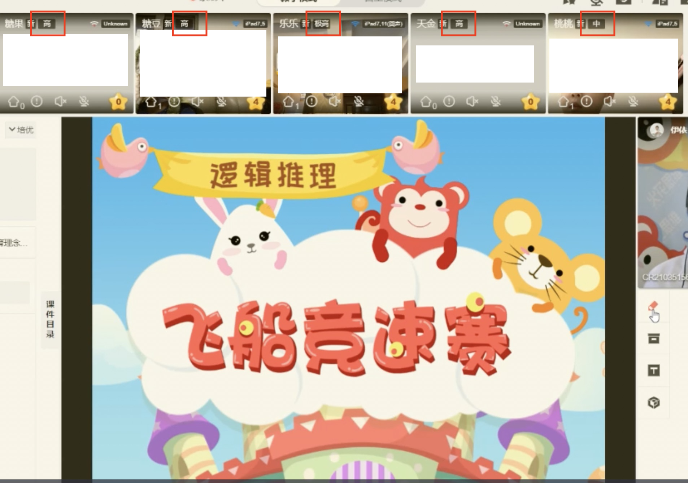
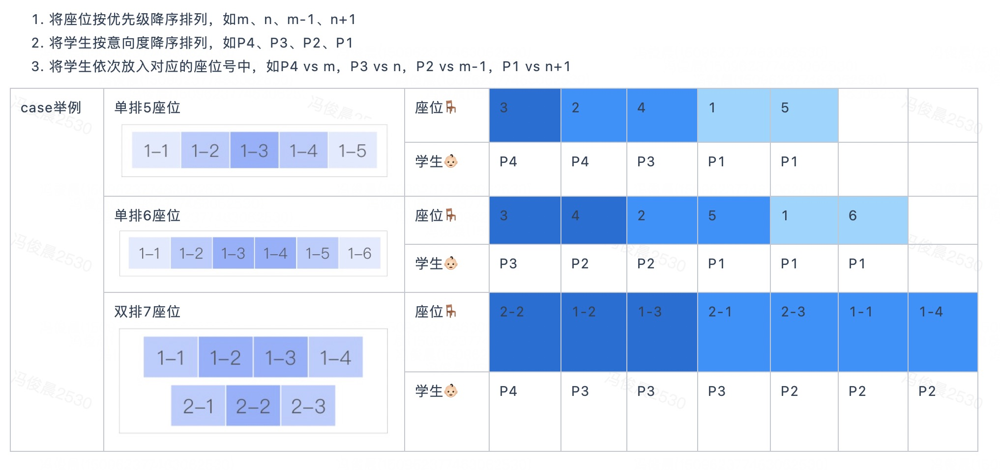

# 业务背景

在用户参加试听课前，我们对于用户的转化率有一个估计。我们在研究如何利用对于用户转化率的估计提高试听课转化率。

在上一个实验中，我们将转化率估计变成三种标签（极高、高、中）；我们发现对于转化率有微弱的正向影响。展示标签的课堂如下图所示

但是我们却没有发现中间过程指标的变化。在访谈中，我们发现部分老师会把高转化率标签的用户放到屏幕正中，增加关注。

教师摄像头在正中，教师看着摄像头才让学生有"视线直对"的感觉；因此老师大部分时间会盯着摄像头，从而对于屏幕正中的学生给予更多的无意识关注。

我们希望在这一轮的实验中探索标签起作用的机制。

为了回答这两个问题，我们设计了如下RBD

1. 以1:1的odds决定是否展示标签

2. 以1:1的odds决定是否将初始学生按照转化概率从中间向两边排序

座位标号和排序方法如下图所示，深蓝色部分我们称为"金刚位"。

# 数据字典

## data set A
不参与实验的课堂学生记录。这些课堂没有参与实验，转化标签没有被展示，课堂也不存在排序

- 用户标识(user_id)
- 用户课堂标识(classroom_id)
- 座位标号(seat_id)
- 是否金刚位(is_king_kong)
- 转化概率(prob)
- 转化概率标签(tag)
- 是否转化(is_pay)

## data set B
参与实验的课堂学生记录，增加了该课堂的实验分组情况

- 用户标识(user_id)
- 用户课堂标识(classroom_id)
- 座位标号(seat_id)
- 是否金刚位(is_king_kong)
- 转化概率(prob)
- 转化概率标签(tag)
- 是否转化(is_pay)
- 是否排序(is_sort)
- 是否展示(is_show)

# 任务要求

## 1.考核目标

为了保证数据安全，我们对于敏感数据进行了脱敏，并且对于付费行为进行了一定的噪音处理。因此，我们不纠结于具体的结论，而关注候选人的

- 进行实验评估和实验设计的能力
- 业务洞察能力和业务沟通能力
- 代码风格

## 2.研究问题

### a. 价值判断
利用上述的业务背景和数据，回答以下问题：

1. 展示用户标签是否存在正收益？

2. 这个正收益是否来自座位排序？

### b. 机制分析

根据上个问题的结论，结合其他数据，给出机制分析（为什么有用或者为什么没用）

### c. 下一步研究设计

对于标签和排序在课堂中的应用，你有新的想法么？你会怎么设计验证你想法的实验？

## 3.汇报

使用Rmarkdown或者iPython Notebook提交一个分析报告。这个分析报告应该包含如下主要内容

- 摘要: 用尽可能容易理解的语言汇报研究问题的三个子问题

- 分析: 用符合可重复研究（reproducible research）的方式展开你的具体分析。你的分析报告中需要包含你的代码。

- 提交：向[mock repo](https://github.com/junchenfeng/huohua_applied_economics_hire)提交一个Pull Request

祝你成功！

